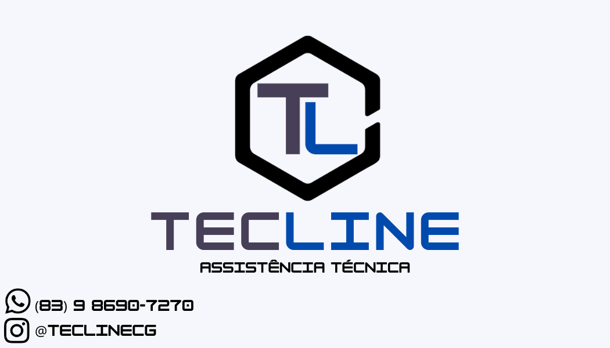

# TecLine OS System API



I used to have a little big problem related to organize em manage my own work orders from my own technical assistance... But I've decide to not have this problem anymore using Spring Boot to model a REST API that fulfills my necessity. I can manage all existing clientes and work orders with their status and also save, update and delete them.

## Entities

### Address

```json
{
    "street": "street_name",
    "number": "house_number",
    "cep": "12345123",
    "neighborhood": "neighborhood_name",
    "city": "city_name",
    "complement": "address_complement"
}
```

### Client

```json
{
    "name": "client_full_name",
    "cpf": "12312312312",
    "phone_number": "83912341234",
    "email": "client_email@email.com",
    "id_address": 1
}
```

### User

```json
{
    "username": "client_cpf",
    "password": "client_phone_number",
    "email": "client_email@email.com",
    "roles": [{"id":  3, "role_name":  "CLIENT"}]
}
```

### OS

```json
{
    "username": "client_cpf",
    "password": "client_phone_number",
    "email": "client_email@email.com",
    "roles": [{"id":  3, "role_name":  "CLIENT"}]
}
```

## Contributing
Pull requests are welcome. For major changes, please open an issue first to discuss what you would like to change.

Please make sure to update tests as appropriate.

## License
[MIT](https://choosealicense.com/licenses/mit/)